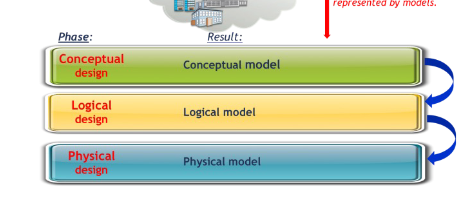
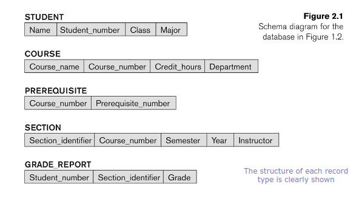
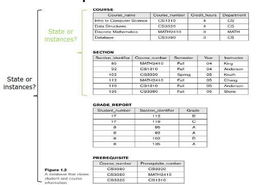
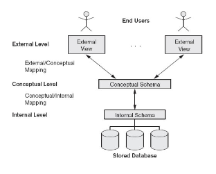

# Lecture 2: Database System Concepts and Architectures

## Data Models

- Abstract representation
- Framwork for conceptualizing, organizing, stroring and manipulating data
  - Specifies nature of data
  - Relationships among data entities
  - Constraints
- Hides low level details

- Categories:
  - Conceptual data model
  - Implementation data model
  - Physical data model

### Conceptual Data Models

- High level
- For end user/customer (non-technical)
- Doesn't care about low level
  - How is data stored?
  - What is the dbms?
- EX: E-R Diagrams
  - Entities: realistic object or concept
  - Attributes: Descriptive properties
  - Relationships: Association between entities

### Representational Data Models

- AKA logical data models
- High level design concepts without regard with physical implemetation
- Features:
  - Define attributes of entities
  - Define primary and secondary keys
  - Relationships between entities
  - More technical audience
  - Basis for application development
- Ex: Object-Relational model
  - Hybrid of relational and oo data models
  - Database can store complex data structures like arrays, objects, and nested records
  - Object-relational features is supported by PostgreSQL and Oracle

### Physical Data Models

- Represents how the model will be built in the database
  - Flat data model (e.g. CSV)
  - NoSQL data models (unique physical storage requirements).
- Low level
- Physical Storage
  - Record formats
  - Record orderings
  - Storage allocation
    - Data block management
    - Data partitioning & replication
  - Indexing strategies
  - Access paths for query execution
    - Table could have multiple access paths

## Schemas, instances, and Database State

- In a data model, there are two distinguishable components:
  - Database description: schema
  - Actual database: data/record instances

### Database Schema

- Description of a database
- Includes descriptions of structure, data types, and constraints
- Schema Diagram
  - Illustrative display of schema
  - Supported by most data models

Example database schema:

### Database State and Instances

- Actual data may change frequently
- **Database state/snapshot**: Actual data stored at a particular point in time
- In a given state, each schema has its own set of *instances*
  - e.g. the STUDENT construct will contain the set of individual student entities as its instances.

Example of a Database state:

- When a new database is created with *no* data, it is in an empty state
- Every time we update the database data, we change one stage of the database into another state

- **Valid State**: A state that satisfies the structure and constraints specified in the schema
  - DBMS is responsible for ensuring that a state is valid
- **Schema Evolution** When the schema needs to be changed as application requirements change

### Three-Schema Architecture

- Proposed to help achieve and visualize the three main characteristics of the database approach
  1. Self Describing nature via use of catalogue
  2. Insulation of programs and data
  3. Support multiple user views

- **Goal** Separate user applications from physical database
- **Internal level**:
  - **Internal schema**: Describes in complete details of the physical storage structure and access paths for the database.
- **Conceptual level**:
  - **Conceptual schema**: Describes structure of entire database
    - Excludes details of physical storage structures
    - Schema desing is based on the use of conceptual data model and a representational data model
- **External/View level**:
  - **External schemas**:
    - Describe various user views
    - Each user group will only see part of database while rest is hidden
    - Each view is implemented using a representation data model

- The three schemas are only descriptions of data
  - Actual data is stored at physical level only
- **Data independence in the three-schema architecture**:
  - The capacity to change the schema at one level of a database system without having to change the schema at the next higher level

### Data Independence

- **Logical Data Independence**
  - The capacity to change the conceptional schema without having to change external schemas and their associated application programs
  - For example:
    - Database expansion & reduction
      - Adding a record type or data item
      - Removing a record type or data item
      - Only the view definition and mappings need to be changed
    - *mappings*: The process of transforming requests and results between levels
    - Database reorganization
      - Constraints changes
      - Restructuring of schema constructs
      - shouldn't affect external schemas

- **Physical Data Independence**
  - The capacity to change the internal schema
without having to change the conceptual
schema
  - For example:
    - Reorganization of some physical files
    - Creating additional access structures

### Centralized and Client-Server DBMS Architectures