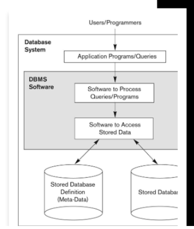

# Lecture One

## Database Systems vs Information Retrevial Systems

|Database Systems|IR Systems|
|-|-|
|Structured Data|Unstructured Data|
|Schema and data model driven|No fixed schema|
|SQL model|Free-from query models|
|Rich metadata operations|Rich data operations|
|Query on exact matching|Approximate matching|
|Queried and updated by user|Only queried by user|

## Basic Definitions

- Database: A collection of related data.
- Data: Known facts that can be recorded and has implicit meaning
  - E.g. names of people
  - E.g. precise emotions of humans?
- Database System: Database + software to allow interfacing with database and application of data.

## Implicit Properties of a Database

- Represents some aspect of the real world, or a miniworld
- Must be logically coherent collection of data with inherent meaning
- Designed, built, and populated with data for a **specific purpose**
  - Like an application
  - Intended group of users

## Some applications of database technology

Relational Data Model

- Student Registry:
  - Student information
  - Course information
  - Section information
  - Grade information

Example: Student
|Name|Student_number|Class|Major|
|-|-|-|-|
|Smith|17|1|CS|
|Brown|8|2|CS|

## DBMSs for Databases

- Database Management System (DBMS):
  - A software package / system to facilitate creation and maintenance of a database
  - Defines a database
    - Specifies data types and constraints of data
  - Constructs of a database
    - Storing data somewhere
  - Manipulates data:
    - Query
    - Update
    - Generate Reports
  - Sharing
    - Allows multiple users / programs to access database simultaneously

## Database System Environment

Data/Database + Software(DBMS) + Application Backend

Application programs interact with the database

- Application programs: Access database via queries to DBMS
  - Query: Retrieve data or information
  - Transaction: Read data or write some data to the database

## More Basic Definitions

- Database: Very large integrated collection of related data
- Database Management System (DBMS): Software system designed to store, manage, and facilitage access to database
- Database System: DBMS software with data itself

## Other Important DBMS Functions

- Protection
  - System protection against hardware or software malfunction
  - Security protection against unauthorized or malicious access
- Data Presentation and Visualization
- Critical Maintenance
  - Maintain the database and associated programs over its lifetime

## Characteristics of Database Approach

### Self Describing nature of a Database system

Metadata:

- Information stored in DBMS catalog that describes the structure of primary database.
- Structure of each file
- Data type and storage format of each data item
- Constraints of the data

Self Documentation:

- Metadata stored in system tables within database
- System tables can be queried by developers to see structure and definitions of tables.

## File Processing vs the Database Approach

- What casued the switch and the advancement?
- What issues lie within traditional file processing for different software?
  - Ex 1) The registrar runs transcript program based on students' files and grades
  - Ex 2) Financial office runs bookkeeping software to keep track of students' fees and payment info.
- Issues:
  - Data files are difficult to maintain and update
  - Structuring data files is difficult
  - Data storage resources are used inefficiently
