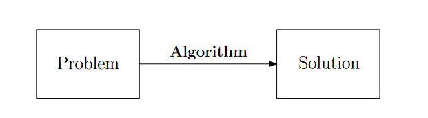
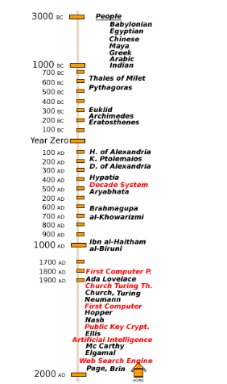
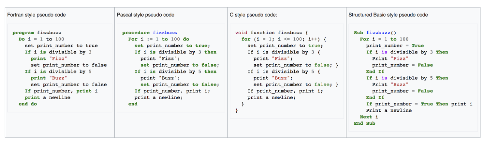
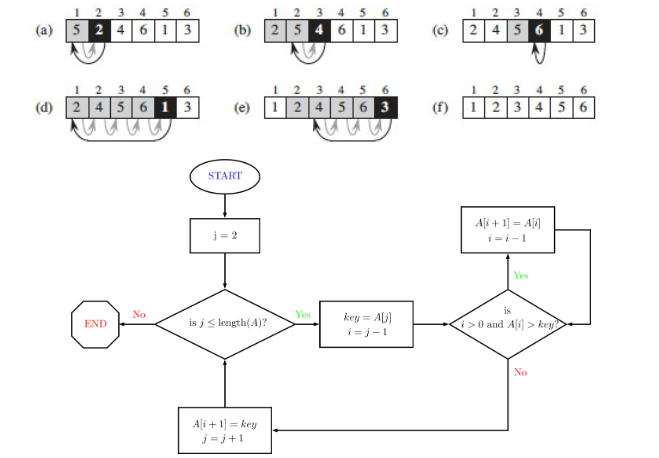

# Topic One: Foundations

## What is an algorithm?

**Algorithm** is a recipe (well-defined procedure) for solving a problem that takes a value (or set of values) as input, and produces some value (or set of values) as output.

**Program** is a specific implementation instance of the algorithm(s) in a specific programming language.

## History of Algorithms

## How do we write algorithms?

Algorithms are not written in programming languages.

Uses different syntaxes when writing an algorithm.

## Example: Insert Sort

Input: Array $n$ of numbers $A = \{a_1, ... , a_n \}$

Output: A permutation (reordering) $A' = \{a'_1, ..., a'_n\}$ of the input sequence such that $a'_1 \leq a'_2 \leq ...\leq a'_n$

## Pseudocode for insertion sort

## Flowchart for insertion sort

## Algorithm Analysis

A problem may have several algorithms

Which algorithm suits best for a given situation?

- Correctness
- Memory (Space)
- Run Time Complexity
- Asymptotic Growth

Even if computers were infinitely fast and had free memory, the algorithm still will need to terminate.

## Intro

**Algorithm** is a recipe (well-defined procedure) for solving a problem that takes a value (or set of values) as input, and produces some value (or set of values) as output.

**Program** is a specific implementation instance of the algorithm(s) in a specific programming language.

Examples:

- Sorting an array
- Solving a maze
- Rendering algorithms
- Searching an array
- Shortest path

Philosophies:

1. Design
2. Analysis

"The most important principle for a good algorithm designer is to refuse to be content" - Aho, Hopcroft, Ullman *The Design & Analysis of Computer Algorithms*

## Integer Multiplication (Karatsuba Algorithm)

Input: Two $n$-digit integers $x, y$

Output: Product $x * y$

Application: *Prime products* in cryptography.

Primitive Operation: "Add / Multiply two single-digit numbers"

## Runtime Analysis

Grade-school algorithm: Carry digits

- Adding 5678 to itself 1234 times requires exponential additions ~ $2^n$ times.
- $3n$ operations for every digit, creating $n$ rows.
- Totals to $3n^2$ operations + $3n^2$ operations of adding rows so $6n^2$ total operations.

n = Number of digits in each number.

x = 5678 => $x_2 = 56, x_1 = 78$ => $x = x_2 * 10^{n/2} + x_1$

y = 1234 => $y_2 = 12, y_1 = 34$ => $y = y_2 * 10^{n/2} +y_1$

$(x_2 * 10^{n/2} + x_1) * (y_2 * 10^{n/2} +y_1) = (x_2 y_2) * 10^n + (x_2 y_1 + x_1 y_2) * 10^{n/2} + x_1 y_1$

Total Time: $T(n) = 4 * T(n/2) + cn$

## Divide and Conquer

Algorithm based on this ^ technique:

1. Compute $x_2 y_2$ -> $T(n/2)$
2. Compute $x_2 y_1$ -> $T(n/2)$
3. Compute $x-1 y_2$ -> $T(n/2)$
4. Compute $x_1 y_1$ -> $T(n/2)$
5. Compute $x_2 y_1 + x_1 y_2$ -> $cn$
6. Compute $(x_2 y_2) * 10^n + (x_2 y_1 + x_1 y_2)* 10^{n/2} + x_1 y_1$ -> $c_2n$

Total run time: $4T(n/2) + c_1n + c_2n$

$T(n) = 4 T(n/2) + cn$

## Master's Method and Recursion Trees

Representation of equation: $T(n) = 4 T(n/2) + cn$

Represent $4 T(n/2) + cn$ as graph or tree

(Insert image here)

$cn$ is a non-recursive term but $T(n/2)$ is a recursive term

Substitute R2 in R1

(image here)

Replace $n$ with $n/3$ in R1 => $T(n/4)$

Substitute R4 in R3

Last level: $T(1)$

If there are $L$ levels: Last level is $4^LT(1)$

Assumption that $n$ is of form $2^k$

$T(n) = \sum_{i=0}^{L-1}{4^ic(\dfrac{n}{2^i})+4^L*T(1)} = cn(2^L-1) + 4^L * T(1)$

$n = 2^{\log_2n} - 1$

$c( 2^{\log_2n} - 1)(2^L-1) + 4^L * T(1) = $

## Karatsuba algorithm

1. compute $x_2y_2$ -> $T(n/2)$
2. compute $x_1y_1$ -> $T(n/2)$
3. compute $x_1 + x_2$ -> $c_1(n/2)$
4. compute $y_1 + y_2$ -> $c_2(n/2)$
5. compute $(x_1 + x_2)(y_1 + y_2)$ ->  $T(n/2)$
6. compute $(x_1 + x_2)(y_1 + y_2) - x_1y_1 - x_2y_2$ -> $c_3n$
7. compute $10^n x_2 y_2 + 10^{n/2}[(x_1 + x_2)(y_1 + y_2) - x_1 y_1 - x_2 y_2] + x_1 y_1$ -> $c_4n$

$T(n) = n^{\log_23}$

## Asymptotic Notation or Big O notation

How does runtime scale with growing input size?

- Suppress lower-order items
- Ignore constant factors

### O-Notation (Asymptotic Upper Bound)

DEF: $T(n) = O[F(n)]$ iff there are positive constants $(c,n_0)$ s.t. $T(n) \leq c * F(n)$ where $n \geq n_0$

Ex: Alg 2 => $T(n) = [c + T(1)]n^2 - c'n = O(n^2)$

Proof: 

- If statement is true, there exists $(c_0, n_0)$ s.t. $[c' + T(1)] * n^2 - c'n \leq c_0 n^2$ whre $n \geq n_0$
- Divide by $n^2$ on both sides: $[c' + T(1)] - c'/n \leq c_0$