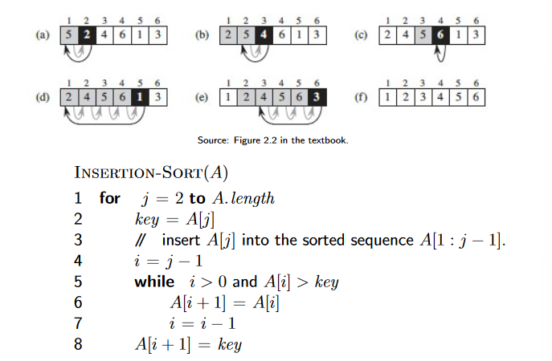

# Topic One: Foundations

## What is an algorithm?

**Algorithm** is a recipe (well-defined procedure) for solving a problem that takes a value (or set of values) as input, and produces some value (or set of values) as output.

**Program** is a specific implementation instance of the algorithm(s) in a specific programming language.

## History of Algorithms

## How do we write algorithms?

Algorithms are not written in programming languages.

Uses different syntaxes when writing an algorithm.

## Example: Insert Sort

Input: Array $n$ of numbers $A = \{a_1, ... , a_n \}$

Output: A permutation (reordering) $A' = \{a'_1, ..., a'_n\}$ of the input sequence such that $a'_1 \leq a'_2 \leq ...\leq a'_n$

## Pseudocode for insertion sort

## Flowchart for insertion sort

## Algorithm Analysis

A problem may have several algorithms

Which algorithm suits best for a given situation?

- Correctness
- Memory (Space)
- Run Time Complexity
- Asymptotic Growth

Even if computers were infinitely fast and had free memory, the algorithm still will need to terminate.

## Intro

**Algorithm** is a recipe (well-defined procedure) for solving a problem that takes a value (or set of values) as input, and produces some value (or set of values) as output.

**Program** is a specific implementation instance of the algorithm(s) in a specific programming language.

Examples:

- Sorting an array
- Solving a maze
- Rendering algorithms
- Searching an array
- Shortest path

Philosophies:

1. Design
2. Analysis

"The most important principle for a good algorithm designer is to refuse to be content" - Aho, Hopcroft, Ullman *The Design & Analysis of Computer Algorithms*

## Integer Multiplication (Karatsuba Algorithm)

Input: Two $n$-digit integers $x, y$

Output: Product $x * y$

Application: *Prime products* in cryptography.

Primitive Operation: "Add / Multiply two single-digit numbers"

Grade-school algorithm: Carry digits

- Adding 5678 to itself 1234 times requires exponential additions ~ $2^n$ times.
- 3$n$ operations for every digit, creating $n$ rows.
- Totals to 3$n^2$ operations + 3$n^2$ operations of adding rows so 6$n^2$ total operations.

x = 5678 => $x_2 = 56, x_1 => 78$ = $x_2 * 10^{n/2} + x_1$

y = 1234 => $y_2 = 12, y_1 = 34$ = $y_2 * 10^{n/2} +y_1$

$(x_2 * 10^{n/2} + x_1) * (y_2 * 10^{n/2} +y_1) = (x_2 y_2) * 10^n + (x_2 y_1 + x_1 y_2) * 10^{n/2} + x_1 y_1$

Total Time: $T(n) = 4 * T(n/2) + cn$

## Runtime Analysis

## Asymptotic Notation

## Divide and Conquer

## Master's Method and Recursion Trees
