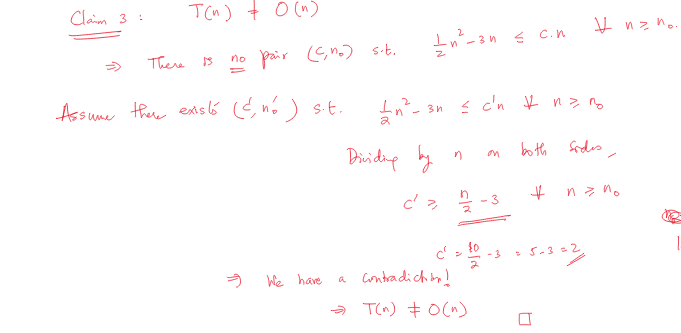

# Lecture 2

## Asymptotic Notation or Big O notation

How does runtime scale with growing input size?

- Suppress lower-order items
- Ignore constant factors

### O-Notation (Asymptotic Upper Bound)

DEF: $T(n) = O[F(n)]$ iff there are positive constants $(c,n_0)$ s.t. $T(n) \leq c * F(n)$ where $n \geq n_0$

Ex: Alg 2 => $T(n) = [c + T(1)]n^2 - c'n = O(n^2)$

Proof:

- If statement is true, there exists $(c_0, n_0)$ s.t. $[c' + T(1)] * n^2 - c'n \leq c_0 n^2$ whre $n \geq n_0$
- Divide by $n^2$ on both sides: $[c' + T(1)] - c'/n \leq c_0$
- $T(n) = O(n^2)$

Interested in the wost case scenario.

### Example 1: Searching an array

I/P: Array A with n integers, and an integer "t"

O/P: Return True if t in A, else False

Algorithm:

```py
for i in A
  if i == n:
    return True
return False
```

|Line|Unit Cost|Total Cost|
|-|-|-|
|L1: `for i=1 to n`|$c_1$|$c_1(n + 1)$|
|L2: `if A[i] = t`|$c_2$|$c_2*n|
|L3: `return TRUE`|$c_3$|$c_3*{1_{\sum_{i-1}^nx_i > 0}}$ where $x_i = \begin{cases} 1 &\text{if A[i]} = 1 \\ 0 &\text{base}\end{cases}$|
|L4: `return FALSE`|$c_4$|$c_4[1-1_{\sum_{i-1}^nx_i > 0}]$|

$T(n) = c_1(n + 1) + c_2n + c_3*1_{\sum_{i-1}^nx_i > 0} + c_4[1-1_{\sum_{i-1}^nx_i > 0}] = c_1i + c_2i + c_3*1_{\sum_{i-1}^nx_i > 0} + c_4[1-1_{\sum_{i-1}^nx_i > 0}]$ where $i$ can never be $\leq n + 1$

$T(n) \leq c_1(n + 1) + c_2n + c_3 + c_4 = (c_1 + c_2)n + (c_1 + c_3 + c_4) < c_n$ where $n > n_0$

Divide by n:

$(c_1 + c_2) + (c_1 + c_3 + c_4)/n < c$ where $n > n_0$

=> Choose $c = (c_1 + c_2) + (c_1 + c_3 + c_4)/n$, for $n_0$

$n > n_0 => 1/n < 1/n_0$

### Example 2: $\text{ }T(n) = 1/2 n^2 - 3n$

**Claim:** $T(n) = O(n^2)$

There exists positive constants $(c, n_0)$ s.t.
  
$1/2n^2 - 3n \leq cn^2$ where $n \geq n_0$

Divide by $n^2$:

$1/2 - 3/n \leq c$ where $n \geq n_0$

**Claim 2:** $T(n) = O(n^3)

There exists positive constants $(c, n_0)$ s.t.

$1/2n^2 - 3n \leq cn^3$

Divide by $n^3$: $c \geq \frac{1}{2n} - \frac{3}{n^2}$

**Claim 3:** $T(n) \not = O(n)$ 

There is no pair $(c, n_0)$ s.t. $1/2n^2 - 3n \leq c'n^3$

