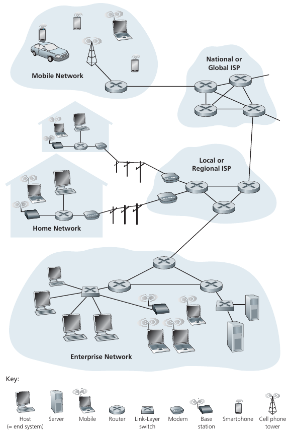
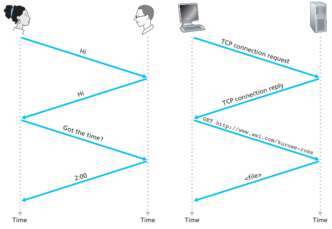
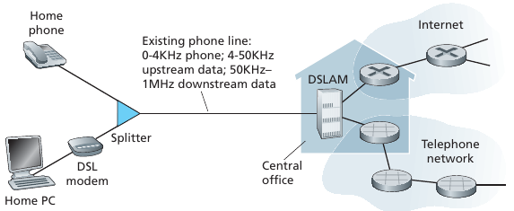
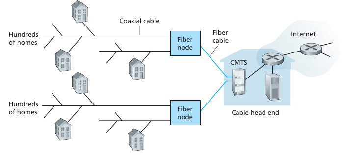
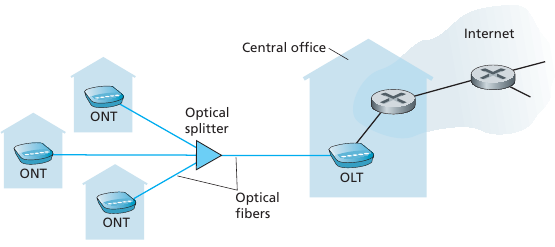
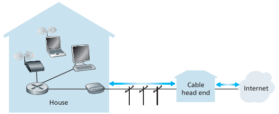
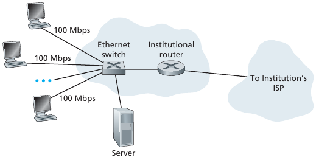
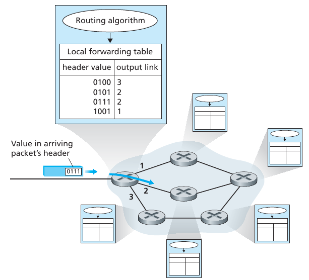

# Lecture 2: Intro

Goal: Get a feel for big picture and terminology

## What is the internet?

### 1.4.1 Physical and Information Infrastructure

Billions of connected devices:

- Hosts = end systems
- Hosts run network apps
- Smart devices run network apps

### Protocols

Similar to human protocol

communication activity is based off network protocol

### Packet order

Arrival order packet joke!
is critical to good a make

### Network edge

Network edge

- Hoses include clients and servers
- Servers are often in data centers

Access networks, physical media:

- Physical connections may be wired, wireless communication links, etc.

Network core:

- Interconnected routers in a bigger network of networks.
This is less visible to end users.

### End systems

Hosts = end systems

### DSL ISP

### Cable ISP

### Fiber / FTTH ISP

### Home network

### Ethernet

### Terms

LAN : a local area network
interconnects hosts that are up to a few or maybe a few tens of kilometers apart.

MAN : a metropolitan area network
interconnects devices that are up to a few hundred kilometers apart.

WAN : a wide area network
interconnects hosts that can be located anywhere on Earth.

### Structures

Mesh: All connected to each other

Bus: All connected to shared medium

Star: Each host connected to a single device at center

Ring: Bus but a loop

Tree: Cascading hierarchy

**The internet functions as a hybrid of all of these**

### Media

Bit:  propagates between transmitter/receiver pairs

Link: Connection between transmitter/receiver pairs

### Functions

Routing:
Determines source-destination route taken by packets.
A variety of routing algorithms exist.
Operates on longer time-scales.

Forwarding:
Move packets from router’s input to appropriate router output.
Chooses instant path of packet.

