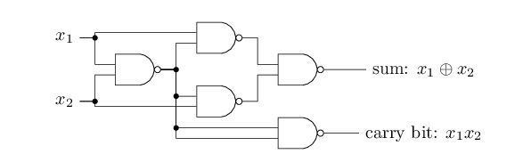
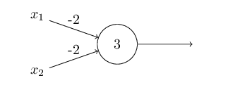
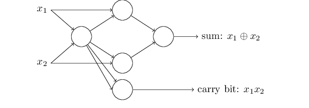

# Chapter One

---

## Perceptrons

### Perceptron: Single boolean output based on several weighted binary inputs

- The output (0 | 1) is determined by a weighted sum of all inputs plus a bias is greater than zero.
- Inputs (x~n~) are binary inputs.
- Weights (w~n~) are real numbers assigned to each input that express the importance of that input.
- The Bias (b) is a value added to the weighted sum to increase the chance of the perceptron being greater than zero.

Algebraically:

### Perceptrons can implement logical NAND functions

Given:

And this Perceptron:

We can replace all NAND gates with the Perceptron:

- Inputs x~1~ and x~2~ each are weighted by -2.
- Each Perceptron has a weight of 3.

This Perceptron logically implement as NAND gates:

| x~1~ | x~2~ | Sum | Output |
| - | - | - | - |
| 0 | 0 | 3 | 1 |
| 0 | 1 | 1 | 1 |
| 1 | 0 | 1 | 1 |
| 1 | 1 | -1 | 0 |

***This means that Perceptrons are universal for computation as NAND gates are universal for computation.***

---

## Sigmoid Neurons

***Perceptrons have the weakness of having a boolean output. Small adjustments in weights in weights and biases can wildly affect behavior of a network.***

Sigmoid Neurons:

- Output = $\sigma(x \cdot w + b)$
- Sigmoid function: $\sigma(z) = \cfrac{1}{1 + e^{-z}}$
- More explicitly: output = $\cfrac{1}{1 + \exp(-\sum_jw_jx_j - b)}$
