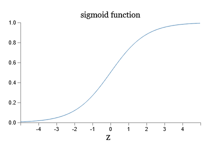
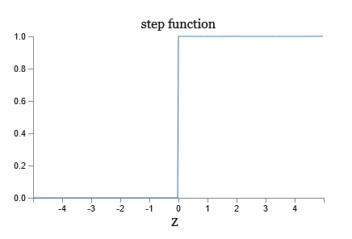

# Chapter One

## Perceptrons

### Perceptron: Single boolean output based on several weighted binary inputs.

- The output (0 | 1) is determined by a weighted sum of all inputs plus a bias is greater than zero.
- Inputs ($x_n$) are binary inputs.
- Weights ($w_n$) are real numbers assigned to each input that express the importance of that input.
- The Bias ($b$) is a value added to the weighted sum to increase the chance of the perceptron being greater than zero.

Algebraically: $\text{output} =
    \begin{cases}
        0 &\text{if } \sum_jw_jx_j \leq \text{threshold} \\
        1 &\text{if } \sum_jw_jx_j > \text{threshold}
    \end{cases}
$
Alternatively: $\text{output} =
    \begin{cases}
        0 &\text{if } w_j \cdot x_j + b \leq 0 \\
        1 &\text{if } w_j \cdot x_j + b > 0
    \end{cases}
$ where $b = -\text{threshold}$

### Perceptrons can implement logical NAND functions

Given:

And this Perceptron:

We can replace all NAND gates with the Perceptron:

- Inputs x~1~ and x~2~ each are weighted by -2.
- Each Perceptron has a weight of 3.

This Perceptron logically implement as NAND gates:

| x~1~ | x~2~ | Sum | Output |
| - | - | - | - |
| 0 | 0 | 3 | 1 |
| 0 | 1 | 1 | 1 |
| 1 | 0 | 1 | 1 |
| 1 | 1 | -1 | 0 |

***This means that Perceptrons are universal for computation as NAND gates are universal for computation.***

## Sigmoid Neurons

***Perceptrons have the weakness of having a boolean output. Small adjustments in weights in weights and biases can wildly affect behavior of a network.***

### Sigmoid Neurons:

- Output = $\sigma(x \cdot w + b)$
- Sigmoid function: $\sigma(z) = \cfrac{1}{1 + e^{-z}}$
- More explicitly: output = $\cfrac{1}{1 + \exp(-\sum_jw_jx_j - b)}$

A Sigmoid Neuron functions similarly to a Perceptron except it provides slight variability to values closer to zero.

For Comparison:

The graph of a sigmoid function is very similar to one of a step function [^1]:

[^1]: One small difference is that when $w \cdot x + b = 0$ the perceptron outputs 0 whereas the step function would output 1.

The curve of $\sigma$ means that changes in the weights ($\Delta w$) or and in the bias ($\Delta b$) will produce a small change in output ($\Delta \text{output}$):
$$\Delta \text{output} \approx \sum_{j}\cfrac{\partial \text{output}}{\partial w_j}\Delta w_j + \cfrac{\partial \text{output}}{\partial b}\Delta b$$

Sigmoid is an arbitrary activation function, and can be replace with other arbitrary activation functions to similar effect.

Sigmoid outputs require some convention to properly interpret an output. For example, interpreting an output of $\geq 0.5$ as true and $< 0.5$ as false.

## Exercises:

### Part I:

> Suppose we take all the weights and biases in a network of perceptrons, and multiply them by a positive constant, c>0. Show that the behaviour of the network doesn't change.

### Part II:

> Suppose we have the same setup as the last problem - a network of perceptrons. Suppose also that the overall input to the network of perceptrons has been chosen. We won't need the actual input value, we just need the input to have been fixed. Suppose the weights and biases are such that w⋅x+b≠0 for the input x to any particular perceptron in the network. Now replace all the perceptrons in the network by sigmoid neurons, and multiply the weights and biases by a positive constant c>0. Show that in the limit as c→∞ the behaviour of this network of sigmoid neurons is exactly the same as the network of perceptrons. How can this fail when w⋅x+b=0 for one of the perceptrons?
