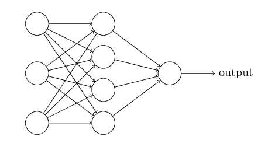
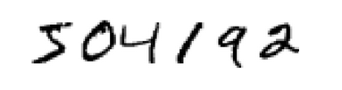
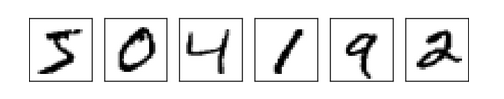
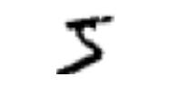
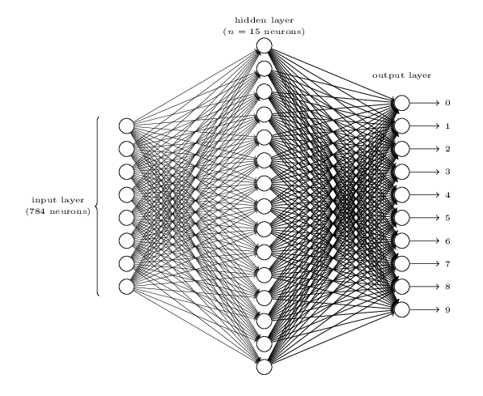
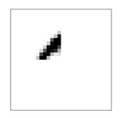
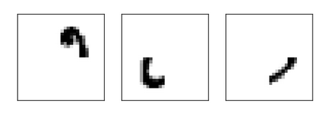
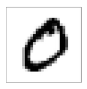
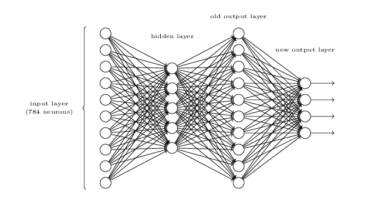

# Chapter One pt 2

## The archtecture of neural networks

Consider this network:

- The leftmost layer is *input layer* and the neurons in this layer are called *input neurons*.
- The rightmost *output layer* contains *output neurons*.
- Middle layers are called *hidden layers*
- Some multilayer networks are sometimes called *multilayer perceptrons*, despite being made of sigmoid neurons.

For the example of network that determines whether a handwritten digit is a "9", the input layer would contain a neuron for each of the 64 x 64 = 4096 greyscale pixels with intensities scaled between 0 and 1. The output layer would be a single neuron where > 0.5 indicates that the image is a 9.

The number of hidden layers can be arbitrary, as there is no "rule of thumb" to their design. Researchers have developed design heuristics for hidden layers that can help control behavior.

Networks where output from one layer serving as inputs for the next layer are called *feed forward networks*. Networks with loops, where the input is predicated on its output should be avoided.

*Recurrent neural networks* circumvent this by inputting initial values then having those outputs serve as its own input later on.

*Recurrent neural networks* function much more similarly to how human brains work, but have been know to be algorithmically less powerful than *feed forward networks*.

## A simple network to classify handwritten digits

This section covers a theoretical network that can recognize a string of handwritten digits on a greyscale image. There are two sub problems:

- Break the image containing many digits into a sequence of separated images.
- Classify each individual digit.

For example, given this image:

Separate it into a sequence of six images:

Then classify each digit as a number ranging from 0-9. In the example the first image:

Would be classified as a 5.

Solving the segmentation problem is fairly straight forward. One approach is running a series of trial segmentations until the individual digit classifier is confident of all segments.

Digit classification will utilize a three-layer network:

- Each *input neuron* corresponds to a greyscale pixel value (from 0-1) on the 28 x 28 image.
- Each *output neuron* corresponds to a digit. The output closest to 1 will be treated as the final output.

The *hidden layers* in the network would try to find patterns in the image. A neuron in this layer does this by heavily weighting its connection to pixels used in patterns such as:

Or:

I an image lights up all of the *input neurons* corresponding to these neurons in the *hidden layer*, then these four neurons will also activate.

These four *hidden layer* neurons are heavily weighted in their connection to 0 in the *output layer*, as these four patterns combine to make up an image of zero:

Zero can also be concluded from translations of the above image or from slight distortions of the above image.

If a four neuron binary output were to be used, it would be less efficient, as the *hidden layers* would have to relate the most significant bit of the digit to hand-drawn shapes.

## Exercise

> There is a way of determining the bitwise representation of a digit by adding an extra layer to the three-layer network above. The extra layer converts the output from the previous layer into a binary representation, as illustrated in the figure below. Find a set of weights and biases for the new output layer. Assume that the first 3 layers of neurons are such that the correct output in the third layer (i.e., the old output layer) has activation at least 0.99, and incorrect outputs have activation less than 0.01.

Because I'm lazy, simply give a weight of 1 to the connection for each of its corresponding bits, and a bias of 1.
